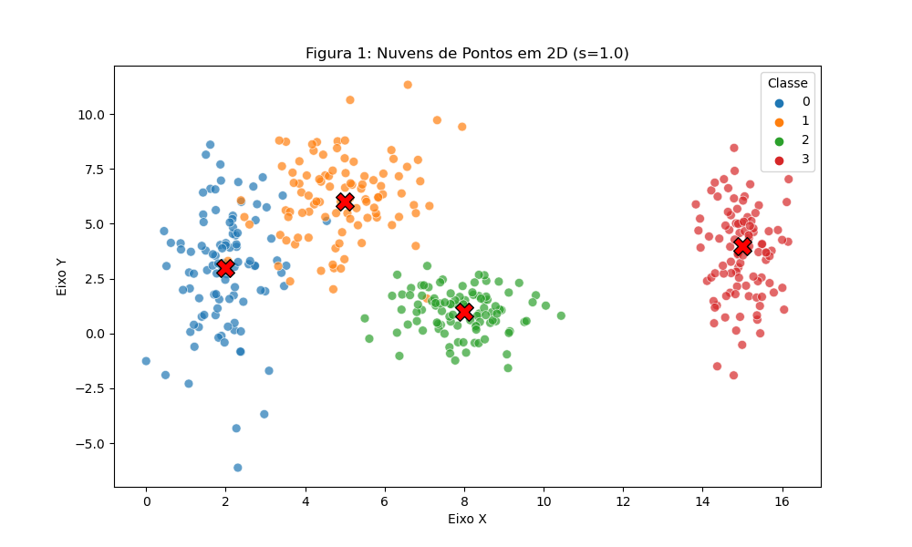
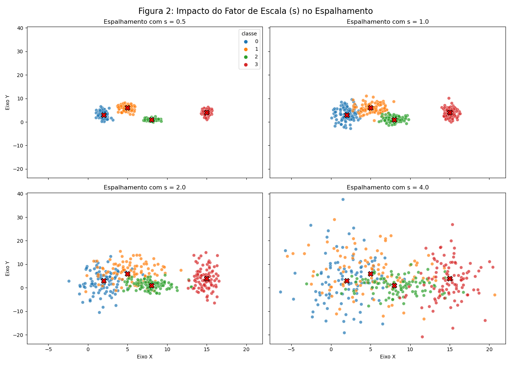
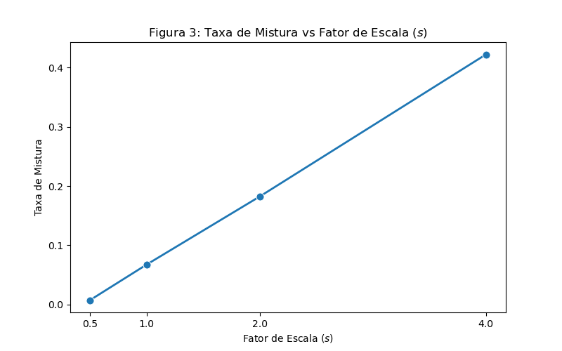
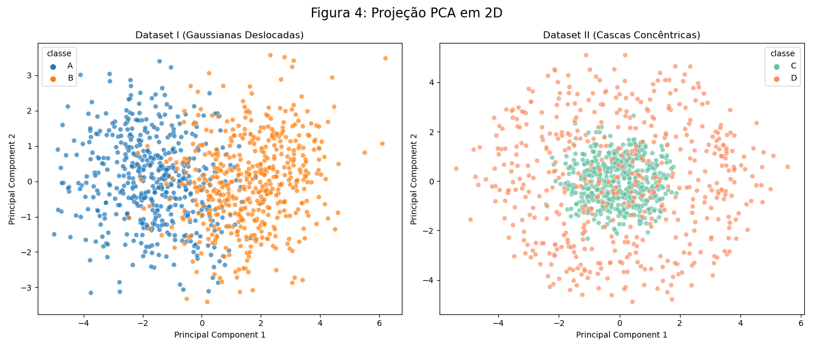
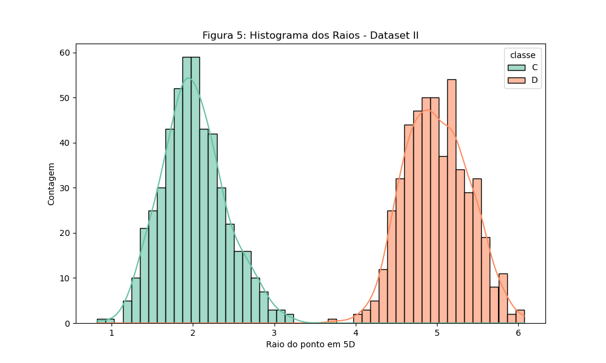
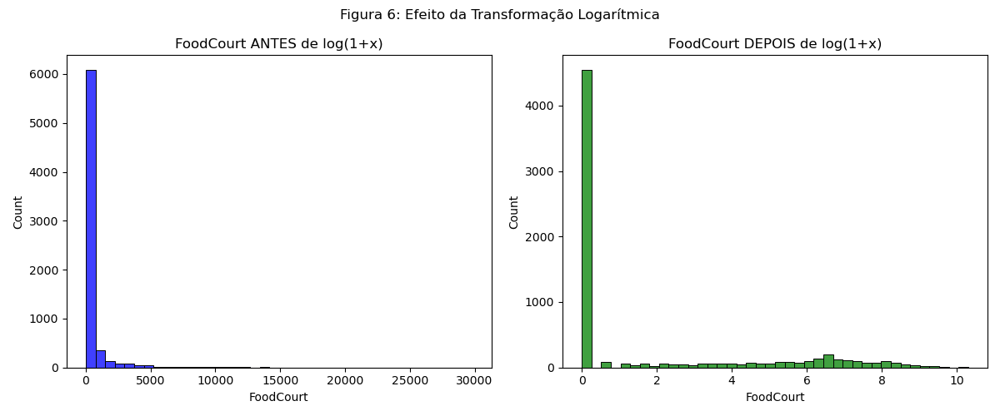

## Exercício 1

### A
A abordagem para este item envolveu a geração de um dataset sintético de 400 amostras divididas em 4 classes usando uma distribuição gaussiana com médias e desvios padrão predefinidos. A semente foi fixada usando `rng = np.random.default_rng(42)`.



```python
--8<-- "docs/exercises/data/code/ex1a.py"
```

### B




* O menor valor da razão de separação $r_{ij}$ em $s=1.0$ é de **1.3258**, referente ao par da **Classe 0 e Classe 1**.
* Como $r_{ij}$ escala com $1/s$, para $s=2.0$ este menor $r_{ij}$ é exatamente a metade: **0.6629**.
* Observando os gráficos, percebemos que a partir do fator de escala $s=1.0$ já não é mais possível usar uma reta para separar perfeitamente todas as nuvens. O ponto de maior sobreposição ocorre justamente entre a Classe 0 e a Classe 1, que começam a se misturar de forma bem clara, esse é exatamente o par que possui o menor $r_{ij}$.

```python
--8<-- "docs/exercises/data/code/ex1b.py"
```

### C
1. **Sobreposição no dataset original ($s=1$):** No dataset original a Classe 3 está totalmente isolada à direita, a Classe 2 está bem concentrada e levemente próxima da Classe 1, mas sem sobreposição significativa e a Classe 0 e a Classe 1 apresentam uma sobreposição maior. Uma única reta divide o plano bidimensional em apenas 2 regiões; como temos 4 classes, é impossível separá-las por apenas 1 linha. O conjunto de fronteiras não conseguiria separar perfeitamente, isolaria as classes 2 e 3 sem problemas, mas devido à zona de sobreposição da classe 0 e 1 nenhuma reta conseguiria separá-los 100%.
2. **Fronteiras de decisão:** A Figura 1 acima já contém o esboço com as fronteiras de decisão que a rede poderia aprender.
3. **Relação com espalhamento:** Quanto mais espalhadas as nuvens, maior se torna a região onde a rede necessariamente erra. Isso acontece porque o aumento do desvio padrão empurra pontos de classes diferentes para exatamente as mesmas coordenadas geométricas no espaço bidimensional. Quando um ponto da Classe 0 e um ponto da Classe 1 ocupam o mesmo local a taxa de mistura aumenta. Nessa região de sobreposição não importa o quão profunda ou complexa seja a arquitetura da rede neural.

## Exercício 2

### A
Geração do Dataset I com gaussianas deslocadas (500 amostras para Classe A e 500 para Classe B em 5 dimensões). Shape do Dataset I: (1000, 6).

```python
--8<-- "docs/exercises/data/code/ex2a.py"
```

### B
Geração do Dataset II de cascas concêntricas (raios 2.0 e 5.0) sorteando direções na esfera unitária. Shape do Dataset II: (1000, 6).

```python
--8<-- "docs/exercises/data/code/ex2b.py"
```

### C


* A variância explicada pelos dois primeiros componentes (PC1 + PC2) no Dataset I é **0.6723** e no Dataset II é **0.4310**. A projeção preserva muito melhor a informação relevante no **Dataset I**.



* Distância entre os centros em 5D (Dataset I): **3.3541**
* Distância entre os centros em 5D (Dataset II): **0.2347**

```python
--8<-- "docs/exercises/data/code/ex2c.py"
```

### D
1. **Análise de Hiperplano:** Essa combinação geométrica prova que as classes são inseparáveis por uma fronteira linear. Como a distância entre os centros é praticamente zero, ambas as classes compartilham a mesma origem geométrica. Um hiperplano atua dividindo o espaço em duas "metades" retas. É impossível fatiar o espaço com uma superfície reta de forma a isolar uma casca externa de um núcleo que está perfeitamente dentro dela.
2. **Inseparabilidade Linear:** O modelo linear assume que a fronteira que divide as classes é reta. Coletar mais dados apenas preencherá o núcleo e a casca de forma mais densa, mas a classe C continuará matematicamente englobada pela classe D.
3. **Transformação PCA:** Uma projeção 2D ruim não prova inseparabilidade. O PCA esmagou o Dataset II em 2 dimensões, misturando totalmente as classes C e D (como visto na Figura 4). No entanto, a Figura 5 (histograma) prova que no espaço 5D original as classes são perfeitamente separáveis, desde que olhemos para a característica certa (o raio da origem). Para separar o Dataset II perfeitamente com uma função matemática simples baseada nas entradas, basta criar uma fronteira de decisão não-linear que calcule o raio ao quadrado. A função seria: $f(x) = \sum_{i=1}^{5} x_{i}^2$. Se $f(x)$ for menor que um valor limiar, por exemplo, o ponto médio entre o fim do núcleo e o começo da casca, o ponto pertence à Classe C (núcleo). Caso contrário, pertence à Classe D (casca).

## Exercício 3

### A
O dataset tem como objetivo prever se um passageiro foi transportado para uma dimensão alternativa durante uma anomalia espacial. A coluna Transported é a nossa variável alvo, assumindo valores booleanos. As classes são quase perfeitamente balanceadas (True: 50.36%, False: 49.63%).

**Features:**
*   **Numéricas:** `Age`, `RoomService`, `FoodCourt`, `ShoppingMall`, `Spa`, `VRDeck`
*   **Categóricas:** `PassengerId`, `HomePlanet`, `CryoSleep`, `Cabin`, `Destination`, `VIP`, `Name`, `Transported`

**Tabela de Faltantes e Gastos:**
Os dados de gastos possuem as seguintes médias e medianas, respectivamente: RoomService (224.68 / 0.0), FoodCourt (458.07 / 0.0), ShoppingMall (173.72 / 0.0), Spa (311.13 / 0.0), VRDeck (304.85 / 0.0). Todos com valor máximo na casa das dezenas de milhares. 
Essa diferença indica que as distribuições são altamente assimétricas com "cauda pesada à direita". A grande maioria dos passageiros não gastou nada, puxando a mediana para zero, mas um grupo muito pequeno de passageiros gastou fortunas, criando outliers extremos que puxam a média matemática para cima.

```python
--8<-- "docs/exercises/data/code/ex3a.py"
```

### B
Divisão 80/20 de forma estratificada pelo alvo, mantendo 6954 linhas no Treino e 1739 no Teste. Se calcularmos estatísticas como médias para imputação ou valores máximos para escalonamento usando o dataset inteiro, o modelo estará, indiretamente, 'espiando' informações do conjunto de teste durante o treinamento. O conjunto de teste deve permanecer totalmente isolado desde o início para garantir que a avaliação final reflita fielmente o poder de generalização do modelo no mundo real.

```python
--8<-- "docs/exercises/data/code/ex3b.py"
```

### C
1. **Dados faltantes:** Para as colunas numéricas, utilizei a mediana, pois é uma distribuição com cauda pesada e outliers extremos que distorceriam a média aritmética. Para as colunas categóricas, apliquei a moda. Os imputadores foram ajustados exclusivamente no conjunto de treinamento e apenas aplicados no conjunto de teste, garantindo que não houvesse vazamento de dados.
2. **Features Categóricas:** As variáveis HomePlanet, CryoSleep, Destination e VIP foram convertidas usando One-Hot Encoding. Para tratar eventuais categorias inéditas que possam surgir apenas no conjunto de teste, o codificador foi configurado com o parâmetro `handle_unknown='ignore'`. Assim, caso o modelo encontre uma string desconhecida, ele preencherá todas as colunas derivadas dessa variável com o valor 0, evitando quebras na execução.
3. **Engenharia de features:** Feature `TotalSpend` criada a partir da soma dos gastos.
4. **Cauda Pesada:** A transformação $\log(1+x)$ foi aplicada às colunas de gastos para comprimir os valores extremos. Essa etapa é crucial para redes neurais que utilizam a função $	anh$, pois valores de entrada muito altos causam a saturação imediata da ativação, zerando os gradientes e impedindo o aprendizado. O logaritmo aproxima essas grandezas, mantendo os dados num regime onde a rede consegue operar.
5. **Escalonamento:** Optei pela normalização explícita para o intervalo $[-1, 1]$ utilizando o MinMaxScaler. Essa escolha alinha a escala das features numéricas perfeitamente com o domínio e a saída da função de ativação tangente hiperbólica.

```python
--8<-- "docs/exercises/data/code/ex3c.py"
```

### D


**Verificação de dados:** 
O shape final da matriz de features de treino ficou em **(6954, 17)** e há 0 NaNs remanescentes tanto no treino quanto no teste. O intervalo de valores contínuos resultante para $	anh$ está contido entre **-1.0000** e **1.0000**.

Dentre todas as decisões de pré-processamento tomadas, a transformação logarítmica ($\log(1+x)$) aliada ao escalonamento para $[-1, 1]$ é a que mais afetaria o sucesso do treinamento da rede neural. A função $	anh$ é altamente sensível e satura rapidamente em seus extremos (aproximando-se de -1 ou 1) quando recebe valores absolutos altos, o que anula os gradientes e trava o aprendizado. Como as colunas de gastos possuíam caudas pesadas com passageiros gastando milhares de dólares, inserir esses dados brutos causaria a saturação instantânea da rede. A aplicação do logaritmo comprimiu esses picos extremos, permitindo que a variação financeira dos passageiros coubesse na região linear e ativa da $	anh$, viabilizando a convergência do modelo.

## Resumo dos resultados

| # | Item | Seu valor |
|---|---|---|
| 1 | Taxa de mistura em `s=0.5` | 0.0000 |
| 2 | Taxa de mistura em `s=1.0` | 0.0675 |
| 3 | Taxa de mistura em `s=2.0` | 0.2250 |
| 4 | Taxa de mistura em `s=4.0` | 0.4175 |
| 5 | Menor `r_{ij}` em `s=1.0`, e qual é o par | 1.3258 (Classe 0 e 1) |
| 6 | Distância entre os centros - Dataset I | 3.3541 |
| 7 | Distância entre os centros - Dataset II | 0.2347 |
| 8 | Variância explicada `PC1+PC2` - Dataset I | 0.6723 |
| 9 | Variância explicada `PC1+PC2` - Dataset II | 0.4310 |
| 10 | Proporção da classe positiva em Transported | 50.36% |
| 11 | Média e mediana de FoodCourt no treino, antes de transformar | Média: 458.077203, Mediana: 0.0 |
| 12 | shape final da matriz de features de treino | (6954, 17) |
| 13 | Mínimo e máximo do treino e do teste após o escalonamento | Mínimo: -1.0, Máximo: 1.0 |